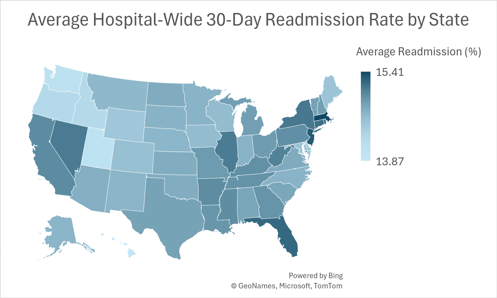

# Hospital 30-Day Readmission Rate Analysis


## Overview
Analysis of CMS hospital readmission data to identify high-risk clinical measures 
and geographic patterns across facility, county, and state levels.

## Preview



## Data
- **Source**: CMS Hospital Compare (public data, from Kaggle)
- **Scope**: 4682 facilities, 50 states (+5 territories), 6 readmission measures
- **Period**: June 30, 2019 - December 30, 2022

## Tools & Methods
- **SQL**: Data cleaning, aggregation, and validation queries
- **Excel**: Report building and summary statistics, some additional cleaning with Power Query
- **Aggregation levels**: Facility / County / State / Clinical Measure
- **Methodology Summary**:
  - **SQL**: Filtered for READM_30_* measure IDs, excluded rows with NULL or suppressed scores (CMS suppresses rates for facilities with <25 cases), and aggregated using AVG() grouped by facility/state/county/measure. Validated record counts against source (4,682 facilities retained after filtering).
  - **Excel**: Used Power Query to standardize facility names and state abbreviations, built a heatmap of readmission rates by measure, and compiled summary tables.
 
## Sample Query
```sql
SELECT "County/Parish" AS county,
	   "State" AS state,
       AVG("Score") AS avg_readmission_rate
FROM "Unplanned_Hospital_Visits-Hospital"
WHERE "Measure ID" = 'READM_30_HOSP_WIDE'
	AND "Score" != "Not Available"
GROUP BY county, state
ORDER BY state, avg_readmission_rate DESC;
```

## Key Findings
- Heart Failure (20.3%) and COPD (19.3%) have the highest readmission rates
- Hip/Knee Replacement has the lowest (4.3%)
- State-level readmission rates range from 13.9% (Hawaii) to 15.4% (Massachusetts)

## Files
```text
sql/ # SQL Scripts for cleaning and aggregation
├── avg_readmission_by_facility.sql 
├── avg_readmission_by_state.sql
├── avg_readmission_by_county.sql
└── avg_readmission_by_cause.sql
excel/ # Report workbook
└── HospitalReadmissions.xlsx
images/ # Preview images
└── heatmap.png
README.md
```

## Limitations
- Averages are unweighted (each facility contributes equally)
- Rates are not risk-adjusted
- Analysis is descriptive, not causal

## Contact
Anja Liudahl | cdliudahl143@gmail.com | github.com/snakevennom143
